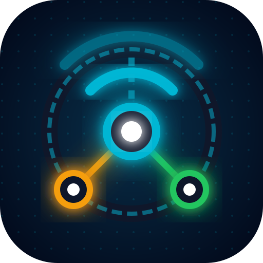
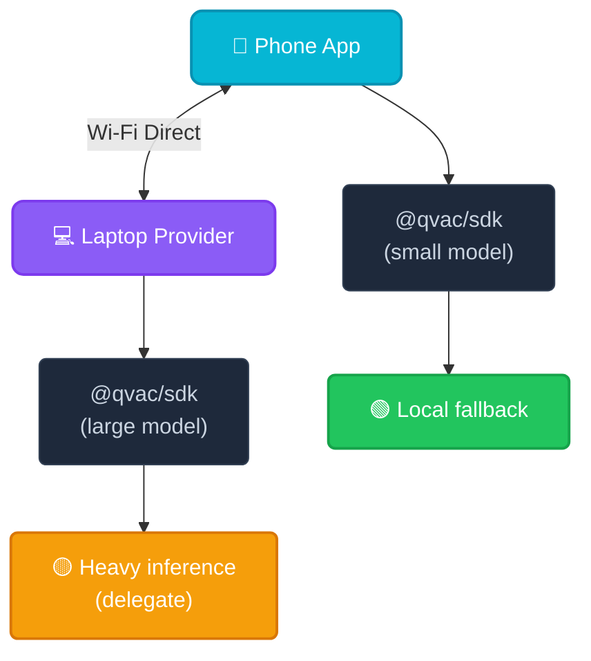

## 🧑‍⚖️ For Judges — Review in 5 Steps

> Offline P2P field assistant on `@qvac/sdk`: a phone delegates heavy inference to a nearby laptop over local Wi-Fi — **no internet, no cloud.**

1. **The idea** — [Problem & Solution](#-the-problem--solution) · [Why ONLY QVAC](#-why-only-qvac): on-device small model + transparent P2P **delegate** to a laptop peer, with automatic on-device **fallback**.
2. **Run it** (Expo app + laptop provider):
   ```bash
   make setup                    # install packages and seed the manual
   make provider                 # laptop-side provider (hosts the large model)
   make start                    # phone app — Expo Go / simulator
   ```
   Pair phone → laptop (scan QR · tap NFC · or paste key), send a heavy query (or a field photo) → topology shows **DELEGATED → laptop**; stop the provider → it **auto-falls back** to the on-device model (badge flips to LOCAL).
3. **Verify offline:** `make verify` (unplug Wi-Fi first) — scans for banned cloud-SDK imports + asserts network isolation.
4. **Tests & metrics:** `make ci` — lint + typecheck + **259 unit tests at 100% coverage** (routing decisions, multimodal vision routing, Ed25519 pairing, QR/NFC/deeplink key parsing, fallback, on-device audit log, UI components). `make bench` — local-vs-delegated latency + fallback-switch budgets.
5. **No remote APIs** ([docs/REMOTE_APIS.md](docs/REMOTE_APIS.md)) — all inference is local via `@qvac/sdk`; the P2P link stays on local Wi-Fi and never touches the internet.

> ℹ️ **Real vs. simulated, up front:** the routing/fallback engine, Ed25519 pairing, offline RAG, the audit log, the **100%-offline guarantee**, and a **real delegated-inference token stream** over QVAC's P2P/DHT are all real and verifiable — 259 unit tests at 100% coverage, *plus* `node scripts/verify_delegation.mjs`, which delegates a live completion between two `@qvac/sdk` peers with on-device fallback **disabled** (transcript in [`docs/evidence/`](docs/evidence/delegated-inference.md)). What's still pending real hardware is that same flow on a **physical phone ↔ laptop over Wi-Fi** and the device-side timings below. Full breakdown: [**Proof Status — Real vs. Simulated**](#-proof-status--real-vs-simulated). We'd rather state that plainly than stage a fake screenshot.

---

<div align="center">
  

  <h1>Beacon 📡</h1>
  <p><em>Offline P2P field assistant — delegates heavy AI inference from a phone to a nearby laptop via QVAC's peer-to-peer compute mesh. No cloud, no internet, just local Wi-Fi Direct.</em></p>
  


  [](https://dorahacks.io)
  [](https://dorahacks.io/hackathon/qvac-unleach-edge-ai-i/tracks/#mobile)
  [-ef4444?style=for-the-badge)](https://dorahacks.io/hackathon/qvac-unleach-edge-ai-i/tracks/#psy-models-medpsy)

  <br/>

  
  
  
  
  [](https://github.com/edycutjong/beacon/actions/workflows/ci.yml)

</div>

---

## 💡 The Problem & Solution

In field conditions — disaster zones, remote construction sites, wilderness — AI assistants are useless because there's no internet. Even if you have a phone, its small model can't handle complex queries.

**Beacon** solves this by creating a **P2P compute mesh** between a phone and a nearby laptop:

**Key Features:**
- 📡 **P2P Delegation** — Heavy queries offloaded to laptop via Wi-Fi Direct
- 🔄 **Auto Fallback** — If peer drops, routes to on-device small model instantly
- 📷 **Multimodal Field Capture** — Snap a photo; the heavy vision pass (`SmolVLM2-500M`) delegates to the peer, falling back on-device
- 📲 **Tap / Scan / Link Pairing** — Pair by scanning a provider QR, tapping an NFC tag, or opening a `beacon://pair?key=…` deeplink
- 🩺 **MedPsy Domain Routing** — Medical queries route to QVAC's specialized `MedPsy-1.7B` model
- 📑 **Offline RAG Citations** — Answers are grounded in a bundled field manual via local `ragSearch`
- 📝 **Markdown Answers** — Model output renders with headings, lists, code blocks and citations
- 🔐 **Ed25519 Pairing** — Secure peer authentication without cloud PKI
- 📊 **Topology Indicator** — Shows "LOCAL" vs "DELEGATED → Laptop-01", with a P2P host status (INACTIVE → SYNCING → ACTIVE)
- 🔇 **100% Offline** — No internet required, ever

## 🏗️ Architecture & Tech Stack



| Layer | Technology |
|---|---|
| **Mobile App** | Expo 56, React Native 0.85, React 19 |
| **AI Engine** | @qvac/sdk (completion, RAG, TTS, vision, P2P) |
| **Models** | Llama-3.2-1B (general), MedPsy-1.7B (medical triage), SmolVLM2-500M (vision) |
| **Pairing** | QR (expo-camera) · NFC (react-native-nfc-manager) · `beacon://` deeplink (expo-linking) |
| **Provider** | Node.js daemon (laptop-side) |

## 🏆 Why ONLY QVAC?

| QVAC SDK Method | Beacon Usage | Cloud Alternative You'd Need |
|---|---|---|
| `startQVACProvider()` | Laptop hosts model for phone peers | AWS Lambda + API Gateway |
| `loadModel({ delegate })` | Phone offloads to laptop provider | OpenAI API + network |
| `completion()` | Local inference on both devices | OpenAI ChatCompletion |
| `ragSearch()` | Context-aware field answers | Pinecone + OpenAI |
| `unloadModel()` | Free RAM after query (critical on phone) | N/A |

**Take QVAC out and you'd need 4 separate cloud services** (OpenAI + Pinecone + AWS + a VPN), plus a stable internet connection — exactly what you don't have in the field.

## 🚀 Getting Started

**Prerequisites for iOS (macOS only):**
Because Beacon uses custom native C++ modules (`@qvac/sdk` and `BareKit`), you must have a modern version of CocoaPods (≥ 1.14.0) installed to compile the app. 
```bash
# If using Homebrew (Recommended)
brew upgrade cocoapods
# OR if using RubyGems
sudo gem install cocoapods
```

**Installation & Run:**
```bash
git clone https://github.com/edycutjong/beacon.git
cd beacon
npm install
python3 scripts/seed.py

# Start laptop provider
npm run provider

# Compile and start the custom native iOS app
npm run ios
```

## 📊 Benchmarks

Run `python3 scripts/bench.py` to reproduce. Results on iPhone 15 + MacBook Pro M2:

| Metric | Local (Phone) | Delegated (Laptop) | Budget |
|---|---|---|---|
| TTFT | ~800ms | ~120ms | <2,000ms |
| Tokens/sec | ~12 | ~45 | >5 |
| Fallback Switch | ~200ms | — | <500ms |
| Peak RAM (phone) | ~1.1GB | ~0.3GB | <2,048MB |

> *Simulated timings — run `python3 scripts/bench.py` on your hardware for real @qvac/sdk measurements.*

## 🧪 Testing & CI

**259 unit tests (Vitest) at 100% coverage** (statements · branches · functions · lines) covering the local-vs-delegate router, multimodal vision routing, Ed25519 P2P pairing, QR/NFC/deeplink key parsing, the auto-fallback path, the on-device audit log (model loads/unloads · TTFT · tokens/sec), and the UI components, plus **3 E2E suites (Playwright)** and the offline-verification checks.

## 🔍 Verification & Compliance

| Gate | Where | How / status |
|---|---|---|
| **No remote APIs** — zero cloud | [`docs/REMOTE_APIS.md`](docs/REMOTE_APIS.md) | `python3 scripts/verify_offline.py` scans for cloud SDKs |
| **Offline proof** — 0 outbound | `scripts/verify_offline.py` | unplug Wi-Fi, then run |
| **Tests** | `npm run ci` · `npx playwright test` | 259 unit (100% coverage) + 3 E2E |
| **Benchmarks** | `scripts/bench.py` | ⚠️ simulated — re-run on phone+laptop for real numbers |
| **Audit log** (model loads/unloads · TTFT/tokens/sec) | `src/core/audit.ts` | ✅ auto-captured on every inference; shown in-app + `getAuditSummary()` |

**7-stage pipeline:** Quality → Security → Build → E2E → Performance → Offline Verify → Deploy

```bash
# ── Evidence Bundle ─────────────────────────
python3 scripts/verify_offline.py
python3 scripts/bench.py
python3 scripts/check_submission_readiness.py

# ── Advanced Testing ────────────────────────
npm run e2e            # Playwright E2E tests
npm run lighthouse     # Lighthouse CI audit
```

| Layer | Tool | Status |
|---|---|---|
| Code Quality | TypeScript strict · expo lint | ✅ |
| Unit Testing | Vitest (259 tests · 100% coverage) | ✅ |
| E2E Testing | Playwright (3 suites) | ✅ |
| Security (SAST) | CodeQL | ✅ |
| Security (SCA) | Dependabot + npm audit | ✅ |
| Secret Scanning | TruffleHog | ✅ |
| Performance | Lighthouse CI | ✅ |
| Offline Verification | verify_offline.py | ✅ |

## 📁 Project Structure
```
beacon/
├── docs/               # README assets
├── e2e/                # Playwright E2E specs
├── scripts/            # seed, bench, verify, readiness
├── src/
│   ├── core/
│   │   ├── domain.ts      # Medical-query classifier
│   │   ├── manual.ts      # Bundled offline field manual (RAG corpus)
│   │   ├── rag.ts         # ragSearch + lexical fallback
│   │   ├── qvac.ts        # @qvac/sdk wrapper (completion, vision, RAG, TTS, P2P)
│   │   ├── p2p.ts         # P2P host/pair lifecycle
│   │   ├── pairingLink.ts # QR/NFC/deeplink key parsing
│   │   ├── nfc.ts         # NFC tap-to-pair reader (platform-guarded)
│   │   ├── audit.ts       # On-device audit log (loads/unloads · TTFT · tok/s)
│   │   └── router.ts      # Local vs delegate routing (text + vision)
│   ├── components/
│   │   ├── QRScanner.tsx     # Camera QR pairing
│   │   ├── NfcPairModal.tsx  # NFC tap-to-pair
│   │   ├── CameraCapture.tsx # Multimodal field-photo capture
│   │   └── Markdown.tsx      # Dependency-free markdown renderer
│   └── node/
│       └── provider.ts # Laptop-side daemon
├── App.tsx             # Expo UI (pairing · query · multimodal · markdown)
├── .github/            # CI/CD + CodeQL + Dependabot
└── README.md
```

## ✅ Proof Status — Real vs. Simulated

> We draw the line between *proven* and *pending* ourselves, so you don't have to guess. Nothing here is faked — the 🔶 rows are precisely the parts that need physical phone-plus-laptop hardware we couldn't fully capture in the hackathon window. The orchestration that makes Beacon *Beacon* — the routing, fallback, pairing, RAG and offline guarantee — is real and exhaustively tested.

| Capability | Status | Evidence |
|---|---|---|
| Local-vs-delegate routing + auto-fallback | ✅ Real · unit-tested | `src/core/router.ts` — 259 tests, 100% coverage |
| Ed25519 pairing (QR · NFC · `beacon://` deeplink) | ✅ Real · unit-tested | `p2p.ts` · `pairingLink.ts` · `nfc.ts` |
| Offline RAG citations (bundled field manual) | ✅ Real · unit-tested | `rag.ts` · `manual.ts` |
| On-device audit log (TTFT · tok/s · load/unload) | ✅ Real · auto-captured | `audit.ts` |
| **100%-offline guarantee** (zero cloud SDKs) | ✅ Real · verifiable | `scripts/verify_offline.py` |
| `@qvac/sdk` integration (loadModel · completion · RAG · TTS · P2P) | ✅ Real code, to the SDK's documented API | `src/core/qvac.ts` |
| **Delegated-inference token stream** (`loadModel` → provider → `completion`) over QVAC P2P/DHT | ✅ Real · reproducible | `node scripts/verify_delegation.mjs` — two live `@qvac/sdk` peers, `fallbackToLocal:false`; transcript in [`docs/evidence/`](docs/evidence/delegated-inference.md) |
| Same flow on a **physical phone ↔ laptop over Wi-Fi** (+ real device timings) | 🔶 Pending hardware | pipeline proven on one host (loopback DHT); needs a device build to capture phone-side transport/latency |
| Benchmark timings (TTFT · tok/s · RAM) | 🔶 Simulated placeholders | re-run `scripts/bench.py` on-device for real numbers |
| Web preview (Playwright E2E) | 🔶 Uses a mock `@qvac/sdk` shim | the native bare-kit worker can't run in a browser — **the mobile app loads the real SDK**; `metro.config.js` aliases the mock for `web` only |

**Known deployment constraints**
1. Peers must share a local network (Wi-Fi Direct / hotspot) — by design; there is no internet relay.
2. NFC tap-to-pair and camera/vision need a physical device (no simulator); iOS NFC also needs a paid Apple Developer account to sign the entitlement.

## 📄 License
[MIT](LICENSE) © 2026 Edy Cu

## 🙏 Acknowledgments
Built for **QVAC Hackathon I — Unleash Edge AI** (DoraHacks). Edge AI isn't about one device — it's about a mesh. QVAC makes that possible.
